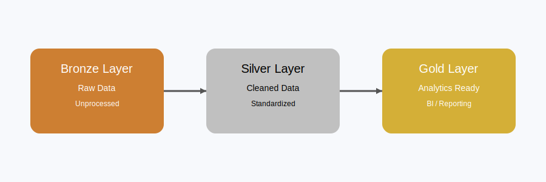

# 🏠 Nashville Housing ETL Pipeline (SQL Server)

## 📌 Project Overview
This project builds an end-to-end ETL pipeline using SQL Server to clean and transform the Nashville Housing dataset.

The dataset contains housing sales in Nashville from 2013 to 2019.

The pipeline follows a **Medallion Architecture (Bronze → Silver → Gold)** to progressively clean, structure, and prepare data for analytics and reporting.

---

## 🏗️ Data Architecture

### 🥉 Bronze Layer (Raw Data)
- Direct ingestion from source dataset  
- No transformations applied  

### 🥈 Silver Layer (Cleaned Data)
- Data cleaning and standardization  
- Handling missing values  
- Splitting and transforming fields  
- Removing duplicate records  

### 🥇 Gold Layer (Analytics-Ready Data)
- Final structured dataset  
- Optimized for reporting and BI tools  
- Ready for dashboards (Power BI / Tableau)  

---

## 🛠️ Tech Stack
- SQL Server  
- T-SQL  
- Data Cleaning  
- ETL Pipeline  
- Medallion Architecture  

---

## 🧹 Key Transformations
- Standardized date formats  
- Filled missing PropertyAddress values
- Split address fields into:
  - Street Address  
  - City  
  - State  
- Standardized categorical values (Y/N → Yes/No)  
- Removed duplicate records  

---

## 📊 Final Output
The Gold layer provides a clean, structured dataset ready for:
- Real estate analysis  
- Business reporting  
- BI dashboards (Power BI / Tableau)  

---

## 🚀 Outcome
This project demonstrates practical SQL skills in:
- Data cleaning and transformation  
- ETL pipeline design  
- Data modeling using layered architecture  
- Handling real-world messy datasets
---

## 📌 Author
**BRAHIM BADREDDINE**
